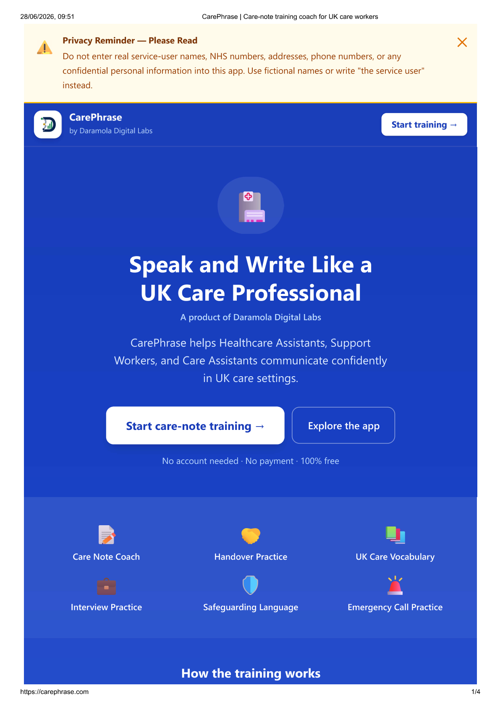

# CarePhrase – AI Care Documentation Coach



---

**by Daramola Digital Labs**

> *Data · Innovation · Impact*

CarePhrase is an AI-powered training platform that helps UK health and social care professionals improve care documentation, communication, safeguarding awareness, and workplace English through realistic practice scenarios and structured feedback.

## 🌐 Live Demo

**Application:** https://carephrase.com

---

## About Daramola Digital Labs

Daramola Digital Labs builds practical, data-driven digital tools that support compliance, financial reporting, research, education, healthcare and community development. Our products combine data analysis, automation and user-centred design to solve real-world problems.

---

## Features

| Feature | Description |
|---|---|
| 📝 Care Note Coach | Coaching feedback to help care workers write clear, factual, CQC-aligned care notes. The app never writes or rewrites notes — it trains the carer to improve their own. |
| 🤝 Handover Practice | Practise structured care handovers with AI feedback |
| 📚 Care Vocabulary | Learn 14+ key UK health and social care terms |
| 💼 Interview Practice | Prepare for HCA and Support Worker interviews |
| 🛡️ Safeguarding Language | Learn how to report safeguarding concerns correctly |
| 🚨 Emergency Call Practice | Practise 999, NHS 111, and on-call nurse calls |

---

## Tech Stack

- **Frontend:** React 19 + TypeScript + Vite
- **Styling:** Tailwind CSS v4
- **AI:** Claude claude-opus-4-8 via Anthropic API
- **Backend:** Node.js Express (local) / Vercel Serverless Functions (production)
- **Hosting:** Vercel

---

## Local Development

### Prerequisites
- Node.js 18+
- An Anthropic API key from [console.anthropic.com](https://console.anthropic.com)

### Setup

```bash
# Clone the repo
git clone https://github.com/dju78/carephrase.git
cd carephrase

# Install dependencies
npm install

# Add your API key
cp .env.example .env
# Edit .env and add: ANTHROPIC_API_KEY=your-key-here
```

### Running locally

Open two terminals:

**Terminal 1 — API server:**
```bash
node server.js
```

**Terminal 2 — Frontend:**
```bash
node ./node_modules/vite/bin/vite.js
```

Then open http://localhost:5173

---

## Deployment

The app is deployed on Vercel. Serverless API functions are in the `/api` folder.

**Environment variable required on Vercel:**
```
ANTHROPIC_API_KEY=your-anthropic-api-key
```

---

## Privacy

- No user accounts
- No personal data stored
- Users are reminded not to enter real service-user names or NHS numbers
- API key is server-side only — never exposed to the browser

---

## Roadmap

Planned enhancements include:

## Roadmap

Planned enhancements include:

- Advanced AI care note coaching
- Safeguarding communication scenarios
- Emergency communication practice
- Expanded UK care vocabulary
- Interview preparation module
- Personalised learner dashboard
- Organisation reporting for care providers
- Performance analytics
- Mobile-first learning improvements
- Expanded UK care vocabulary and documentation exercises

## Licence

© 2026 Daramola Digital Labs. All rights reserved.
